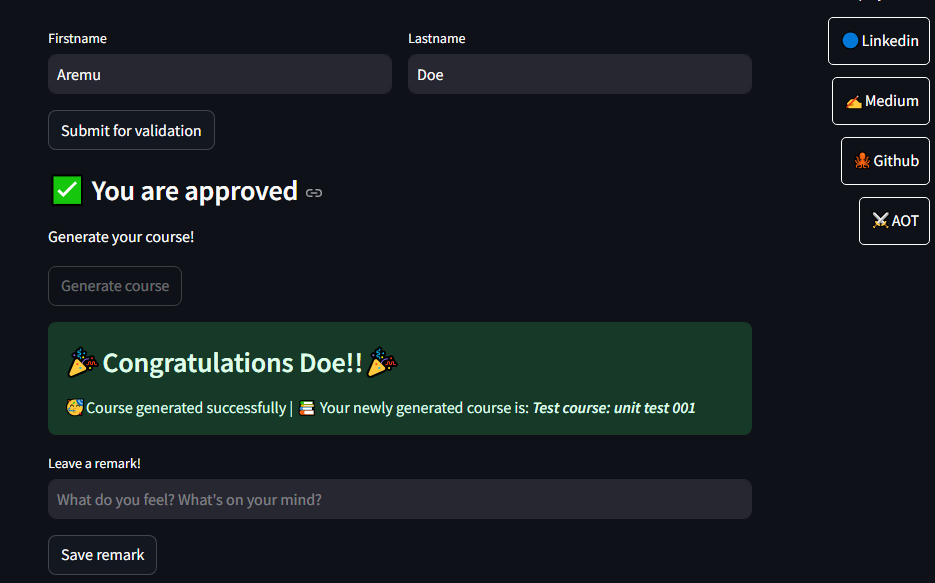

# Course Assigner Application
So I and a couple of friends want to study together, we are using a group study technique that assigns each group member a course to anchor. This is my little contribution to the entire process.

### The Technique:
The technique we choose to work with is simple. Each person will be assigned a course that they must study intensiely, master and teach to the others. After a given period of time the entire group will come together and everyone will share knowledge of their respective courses ensuring other comprehend it properly.
#### Why use this technique?
This technique was chosen because it is significantly easier and less time consuming to learn about a thing from someone who has deep understanding about that thing than it is to research and study about the thing by ones self.  
Ofcourse there is a time-depth tradeoff here but we are willing to work with it anyway.  

Each person can build up on the comprehensive knowledge they got in order to make up for the depth, but that isn't necessary except you want to write a research paper of your own
### Why This App?
We needed a way to assign a course to a person without partiality or bias, courses are, ofcourse, of different levels of complexity. So we eliminate then likelihood of a "You guys gave me the most difficult course 😭.....yada yada yada".  

"Chill dawg, your lastname gave you that course".

## How Does This App Work
TO ensure fairness this app uses the python random module, but I also wanted reproducability so I made sure the app uses a random seed partialy determined by the person generating his/her course.  
The application would generate a random seed based on the lastname and firstname of the person applying, they must use their verified lastname but the can use anything they want for their firstname ensuring that I, the creator, do not know what course they will be assigned.  
After generating the seed, it is used to select a course from the list of courses for the user, this course is presented to the user and data of the operation is then stored.  
Some data stored include:

    - Name
    - Seed
    - Selelcted course
    - Remark
    - TIme e.t.c.

Thanks for reading to the end, arigato gozaimasu, arrivederci.

